<h1 align="center">Plantley</h1>

[View the live project here.](https://plantley.herokuapp.com)

Plantley is an ecommerce site that allow customers to buy houseplants. Customers can create an account, but they can also buy plants without signing in.

<br/>
<br/>
<br/>

## User Experience (UX)

<hr>

### User stories

- As a potential user, I want to be able to register for an account.
- As a current user, I want to be able to log in and out of my account.
- As a current user, I want to be able to update my details such as my name, email address, and password.

- As a user, I want to see a homepage, with a navigation that will lead me to different parts of the e-commerce site.
- As a user and potential customer, I want to see a list of plants being sold, with their name, picture and price.
- As a user, I want to see all the details about a specific plant.
- As a user, I want to be able to add a plant item to the basket and also be able to specify the number of plants that I want to buy.
- As a user, I want to see a cart page that shows a list of all the items I want to buy.
- As a user, I want to be able to pay for my items.
- As a user, I want to see information about my order (or orders if I ordered multiple times.)

- As an admin user, I want to be able to manage my plant items in the inventory, with the ability to:
  - Create a plant item
  - Edit a plant item
  - Delete a plant item

### Wireframes

- Basic wireframe is available [here](README_IMAGES/plantley_wireframe.pdf)

<br>
<br>

## Database architecture

<hr>
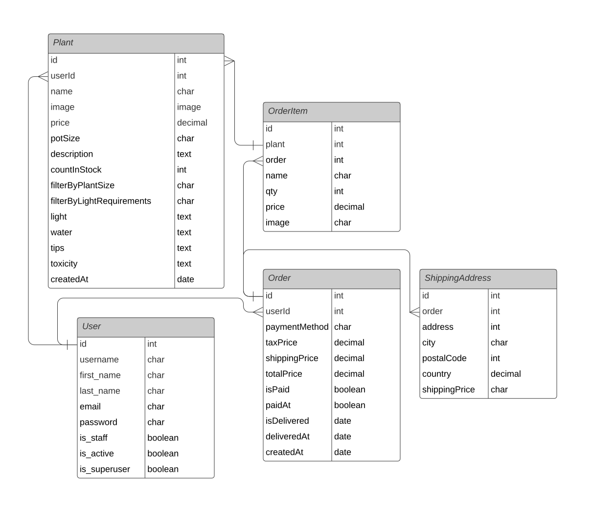
<br>
<br>

**Summary**

- User model is from Django
- Plant is connected to user by one to many relationsip because a user can build up multiple products.
- A user can build an order, and inside of Order there is OrderItem.
- OrderItem is connected to Product
- Order is connected to ShippingAddress
  <br>
  <br>

## Features

<hr>

### Register, Log In, Update User Details, Log out

- As a potential user, I want to be able to register for an account.
- As a current user, I want to be able to log in and out of my account.
- As a current user, I want to be able to update my details such as my name, email address, and password.

**Register**
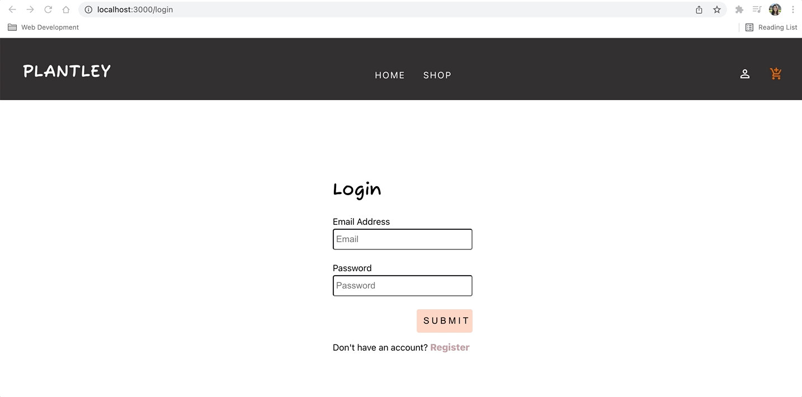

**Log In**
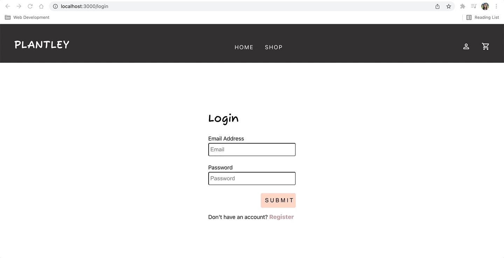

**Update Details**
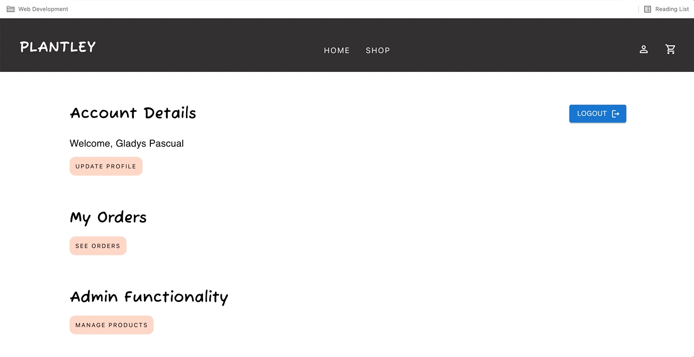

- Forms uses [react-hook-form](https://react-hook-form.com/) (more details about the library in later section) which includes a validation on:

  - Email Address: need to be in an email format
  - Full Name: minimum of 3 characters
  - Password: minimum of 5 characters

  <br>

### As a user, I want to see a homepage, with a navigation that will lead me to different parts of the e-commerce site.

- Navigation bar is responsive.
  

- Navigation bar has a cart icon, where it changes when an item is added on the basket.
  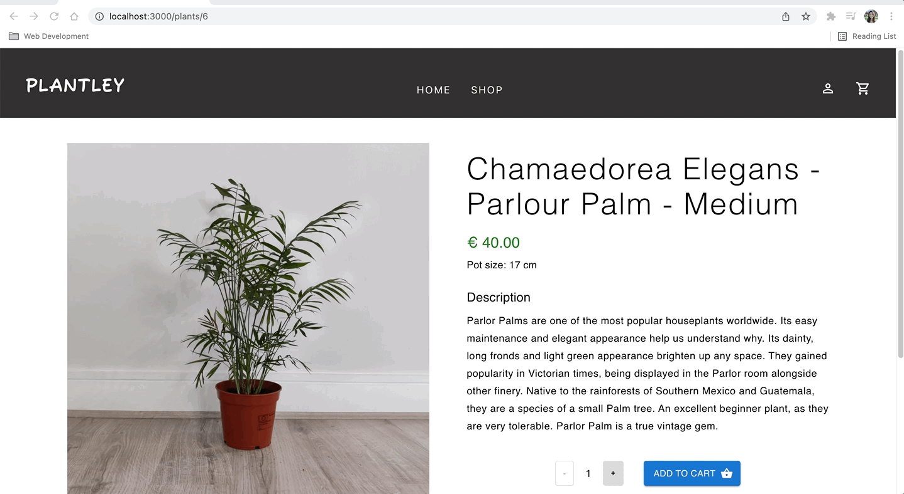

<br>

### As a user and potential customer, I want to see a list of plants being sold, with their name, picture and price.

  
<br>

### As a user, I want to see all the details about a specific plant.

  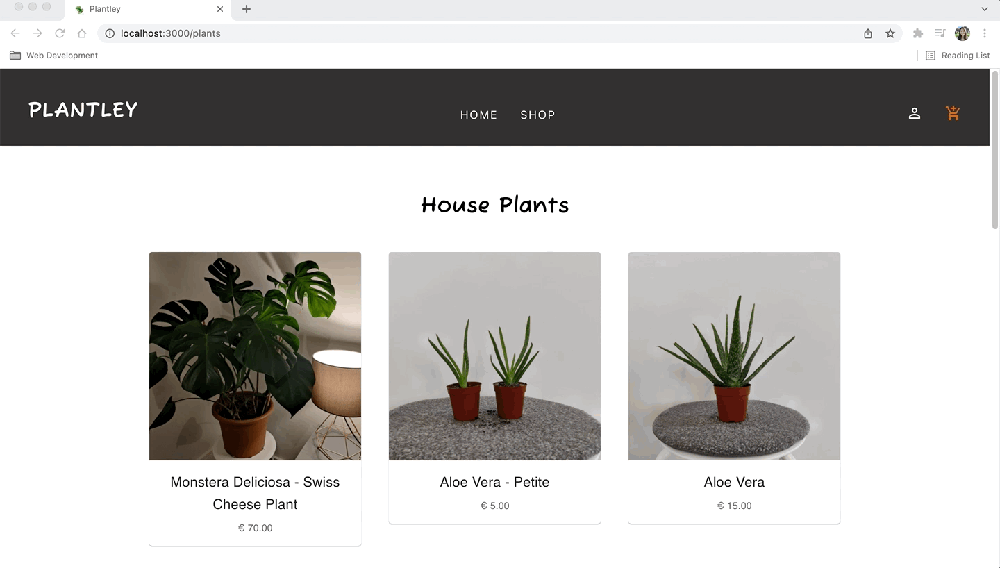

<br>

### Adding to cart and seeing a total in cart page

- As a user, I want to be able to add a plant item to the basket and also be able to specify the number of plants that I want to buy.
- As a user, I want to see a cart page that shows a list of all the items I want to buy.

_Feature_

- When an item is successfully added, a 'snackbar' message is shown saying that the item and its quantity is added to the cart, with a link to the cart page.

  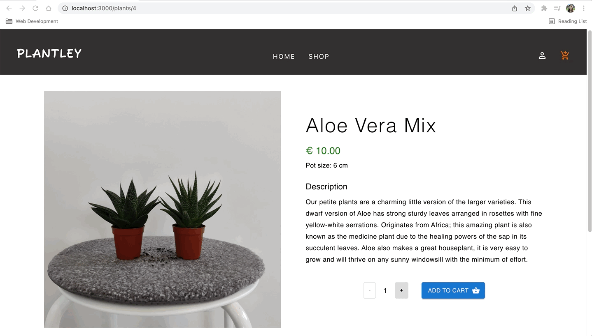

<br>

### As a user, I want to be able to pay for my items.

  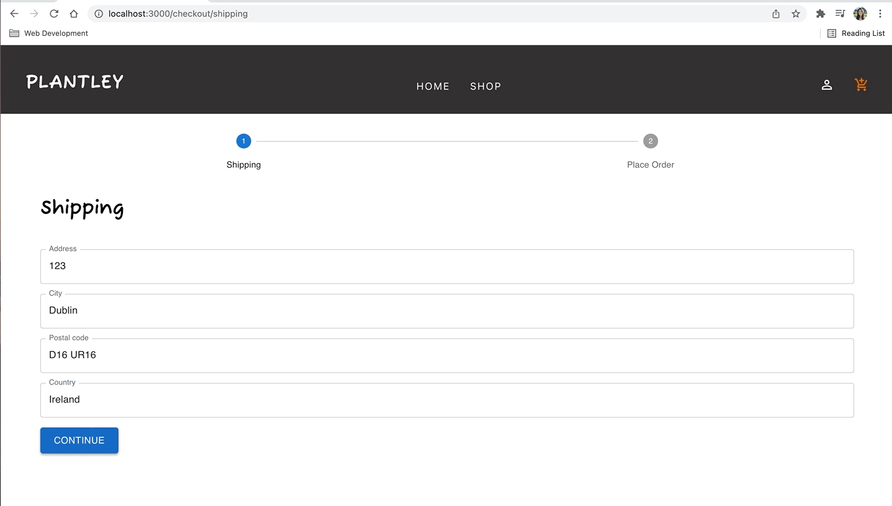

_Payment flow_

- In `/cart`, as the Checkout button is clicked, the user is lead to `/checkout/shipping`.
- The `/checkout/shipping` has a stepper component on the top where it has two steps:

  1. Shipping: user fills their shipping address. This form has a validation where all fields are required.
  2. Place Order: an outline of the shipping address, payment method, items to be ordered, and a table of total cost of items with tax, shipping and total cost.

- Once the Place Order button is clicked, the user is lead to `/order/{orderId}` where the user can pay for their item
- As the user clicks the 'Pay Now' button, the stripe component form where the credit card details can be entered.
- If payment is successful, the user is lead to a page with the 'payment_intent' id is in the URL. The payment intent id gets sent to the backend, and the backend check if it's already paid. If so, it updates the `isPaid` key in the Order model in the databse to true.

- <br>

### As a user, I want to see information about my order (or orders if I ordered multiple times.)

- In the `users/profile`, the 'See Orders' button will lead you to a table with a table of orders made by the user.
  <br>

## Admin features

### As an admin user, I want to be able to manage my plant items in the inventory, with the ability to:

- Create a plant item
  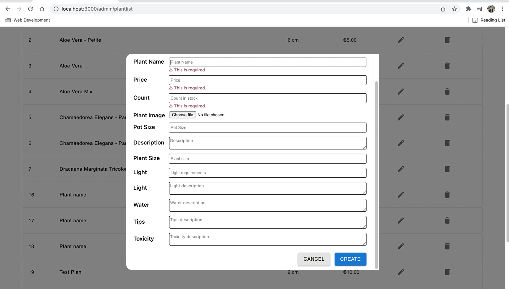

- Edit a plant item
  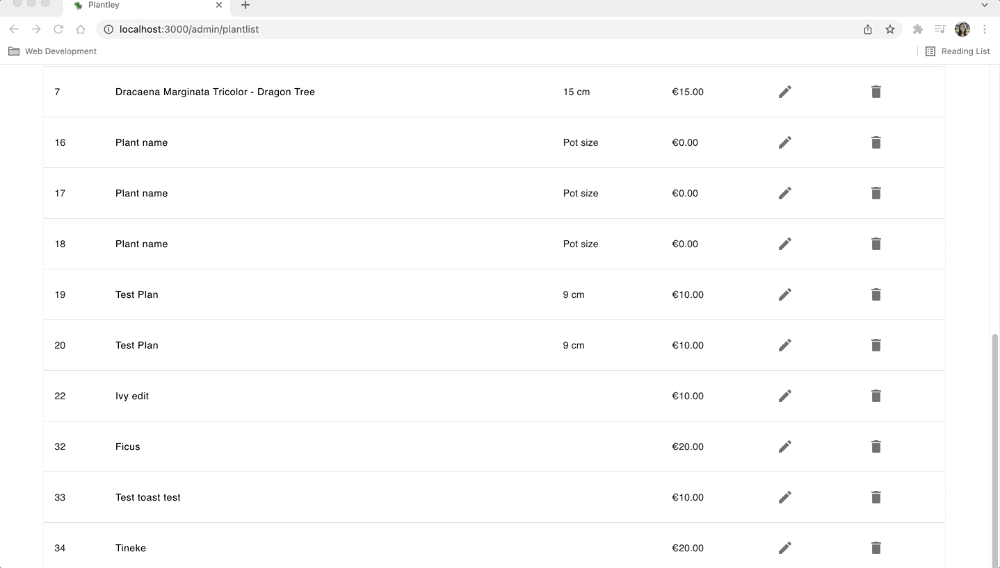

- Delete a plant item
  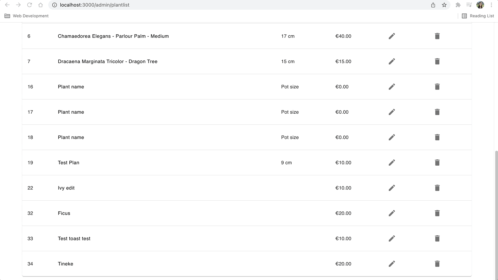

<br>

### Accessibility

- Best effort to keep the website accesssible was done. First, a component library such as Material UI was used to ensure that the components used are accesible. For example, the modal component of Material UI can exit the modal using the escape button, and has a screen reader label.
- `alt` were passed on all the images
- react-hook-form, the library used for the forms, accomodates keyboard actions such as tabbing into different inputs and enter key to submit the form.

<br/>

## Technologies Used

<hr>

Django on the backend where we'll build out the database and API
React on the frontend
Connect these two, put them up on a live server using heroku, postgress for the database.

<br/>

### Languages, Frameworks, Libraries & Programs Used

**Backend**

- [Python 3.8.2](https://www.python.org/download/releases/3.0/)
- [Django](https://www.djangoproject.com/)

  To install, run:

  ```
  pip install django
  django-admin startproject backend
  cd backend
  python manage.py runserver
  ```

  To create a base app where the views and models are written:

  ```
  python manage.py startapp base
  ```

  - `models.py` contains all the models for this project.
  - the views and urls are divided into three main sections for clarity
    - order
    - plant
    - user

- [Django REST framework](https://www.django-rest-framework.org/)

  - Django REST framework allows for more flexible and powerful building of web APIs

  To install, run:

  ```
  pip install djangorestframework
  ```

- [Pillow](https://pillow.readthedocs.io/en/stable/)

  - Pillow is an image processing library that allows for interpretation of images.

  To install, run:

  ```
  pip install pillow
  ```

- [Django cors headers](https://pypi.org/project/django-cors-headers/)

**Frontend**

- [JavaScript](https://en.wikipedia.org/wiki/JavaScript)
- [HTML5](https://en.wikipedia.org/wiki/HTML5)
- [CSS3](https://en.wikipedia.org/wiki/Cascading_Style_Sheets)
- [React](https://reactjs.org/)

  - React is a JavaScript library used for building user interfaces through encapsulated components that manage their own state.

- [Typescript](https://www.typescriptlang.org/)

  - TypeScript is a strongly typed programming language that builds on JavaScript, with a tight integration to VS Code editor.
  - It's main advantage is **it allows to catch errors early in the editor**.

  To [create](https://create-react-app.dev/docs/adding-typescript/) a React project with Typescript

  ```
  npx create-react-app my-app --template typescript
  cd frontend
  yarn start
  ```

- [Axios](https://github.com/axios/axios)

  - Axios is a JavaScript library that allows making an HTTP request, and an alternative to the .fetch()
  - Some of the advantages of using axios over the fetch method are that axios performs automatic transforms of JSON data and has better browser support compared to the fetch method.

  To install, run:

  ```
  yarn add axios
  ```

- [react-query](https://react-query.tanstack.com/)

  - React Query is a library that manages server state for your react app.
  - React Query makes fetching, caching, synchronizing and updating server state in your React applications simpler. For more information, see this [part](https://react-query.tanstack.com/overview) of the documentation.

  To install, run:

  ```
  yarn add react-query
  ```

- [react-router-dom](https://reactrouter.com/web/guides/quick-start)

  - React is single page application. react-router-dom library allows for the application to navigate between different components, changing the browser URL, modifying the browser history, and keeping the UI state in sync.

  To install:

  ```
  yarn add react-router-dom
  ```

- [react-hook-form](https://react-hook-form.com/)

  To install:

  ```
  yarn add react-hook-form
  ```

- [material ui](https://mui.com/)

  - Material UI component library was used for this project to reduce the risk of variation throughout the application.
  - Using a component library allows for faster builds in the frontend.

- [Heroku](https://heroku.com/)
  - Used to deploy the project.

## Testing

- [msw](https://mswjs.io/)
  - used in the frontend / React application to mock the endpoint in order to test the component.
  - HomePage and PlantDetailPage were tested to make sure that the pages render as expected, using [react-testing-library](https://testing-library.com/docs/react-testing-library/intro/). This library's principle of testing is to avoid including implementation details of your components and rather focus on making your tests give you the confidence for which they are intended, such as what the user sees.
    `backend/frontend/src/pages/HomePage/HomePage.test.tsx`
    `backend/frontend/src/pages/PlantDetailPage/PlantDetailPage.test.tsx`

<hr>

### Manual testing were also performed to ensure that the application works as intended. During this, the following errors were found and were rectified:

1. Loading and error page are shown at the same time
   - condition was changed so that error is only shown if loading is false already.
   - there are times that there was error, saved in cache, therefore it's true
   - refetching item again therefore loading
   - putting the condition of not loading and error true covers this
2. Plant details page showing headings even when content is empty
   - conditionally render the text if the object is present (plant order details)

<br>

3.  Error during deployment on heroku

2022-01-05T03:56:27.861498+00:00 heroku[router]: at=error code=H10 desc="App crashed" method=GET path="/" host=plantley.herokuapp.com request_id=08c84731-9dce-4bbc-b1b6-dad33197e97b fwd="64.43.25.141" dyno= connect= service= status=503 bytes= protocol=https

2022-01-05T03:56:28.167364+00:00 heroku[router]: at=error code=H10 desc="App crashed" method=GET path="/favicon.ico" host=plantley.herokuapp.com request_id=c618b704-0717-4523-a392-2cd30c6f3e3f fwd="64.43.25.141" dyno= connect= service= status=503 bytes= protocol=https

Initial Solution: https://dev.to/lawrence_eagles/causes-of-heroku-h10-app-crashed-error-and-how-to-solve-them-3jnl

Did not work. Figured out that the file structure was incorrect. Procfile needs to be on the same level as manage.py
<br>

4. In the deployed app, when paying for an item, after successfully paying, we get this error page. Order database table and stripe payment in the account was checked. The problem was since we're using `hashrouter`, the order of `payment_intent` and `hash` is different. To solve, a `useEffect` is written to run the following logic when the component is rendered

```
 React.useEffect(() => {
    if (window.location.href.endsWith('/success')) {
      const cleanUrl = window.location.href.split(window.location.hash)[0];
      const stripeQueryParams = cleanUrl.split(window.location.origin + '/')[1];
      navigate(`/order/${id}/success${stripeQueryParams}`);
    }
  }, [id, navigate]);
```

In this logic, we're splitting the URL to get the query params that stripe gives back, so we can use it on the PUT request that will update if the order is paid.

<br>

5. There was an issue on uploading an image when creating a plant item during deployment. If the user doesn't put an image, a default placeholder picture is uploaded, as intended. If an image was attempted to be uploaded, the image doesn't render corerctly. To try and figure out the issue, I tried uploading an image when deployed locally (through http://127.0.0.1:8000/) but using heroku database. This way, the images are seen in `backend/static/images` when uploaed and rendered in the frontend. Unfortunately, due to lack of time, this issue in production was not solved. The furthest debug that I was able to do was that in production, the image Response Header Content-Type is 'text/html', instead of a 'Content-Type: image/jpeg'. The solution I would do next would be something to do with ensuring that the content type on the response is corrected.
   
   <br>

## Deployment

<hr>

### Heroku

1. Create a heroku account. Create a new app and select your region.
2. Prepare the local workspace for Heroku. Create a requirements.txt file by:

```
pip3 freeze --local > requirements.txt
```

3. Create a Procfile and put:

```
 web: gunicorn backend.wsgi --log-file -
```

4. Connect the GitHub repository to the project and allow for automatic deployment.

### Forking the GitHub Repository

By forking the GitHub Repository we make a copy of the original repository on our GitHub account to view and/or make changes without affecting the original repository by using the following steps:

1. At the top of the Repository, above the "Settings" Button on the menu, locate the "Fork" Button.
2. You should now have a copy of the original repository in your GitHub account.

<br>
<br>

### Making a Local Clone

1. Under the repository name, click "Clone or download".
2. To clone the repository using HTTPS, under "Clone with HTTPS", copy the link.
3. Open Git Bash.
4. Change the current working directory to the location where you want the cloned directory to be made.
5. Type `git clone`, and then paste the URL you copied in Step 2.

```
git clone https://github.com/USERNAME/REPOSITORY
```

## Credits

<hr>

### Code

- Setting up environment to hide stripe secret key in django: [link](https://alicecampkin.medium.com/how-to-set-up-environment-variables-in-django-f3c4db78c55f)

### Content

- Background image from [unsplash](https://unsplash.com/photos/yb3hsmz4utg)
- All content was written by the developer.
